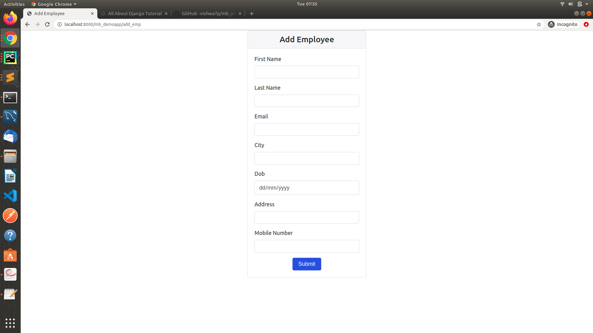
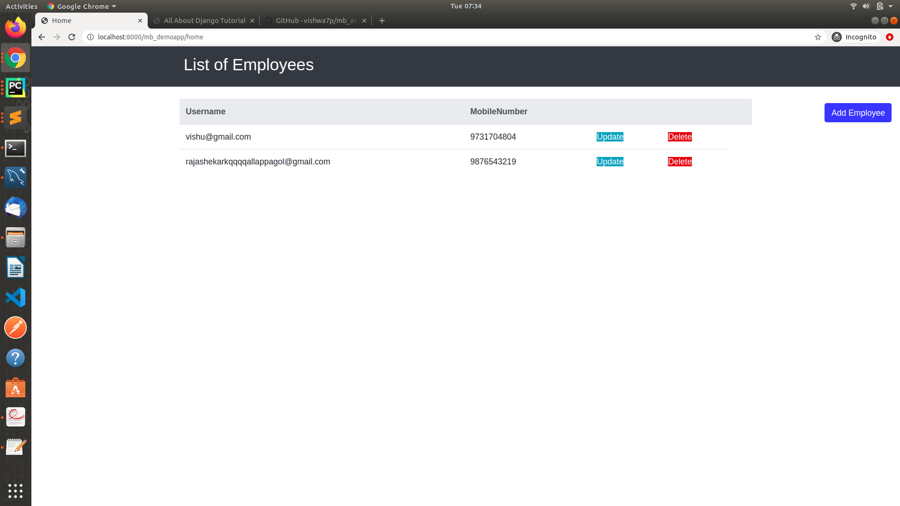
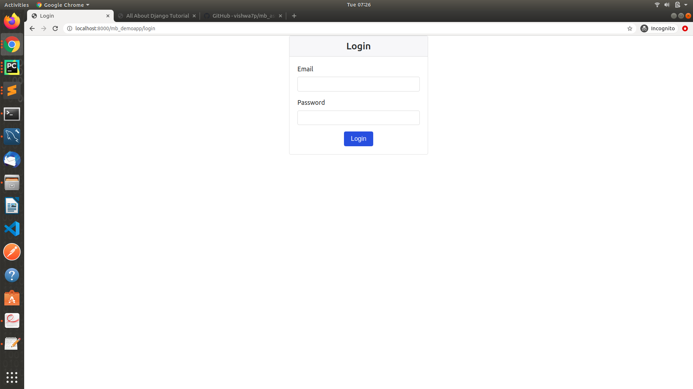
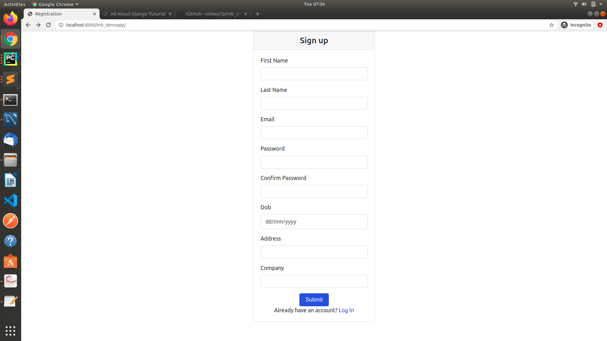

#Manager signup and add employee process.
This is the code repository for project [demo_project in Django](https://github.com/vishwa7p/mb_assignment.git)

It uses Class-Based Views to create CRUD interfaces for a `User` model.(Extended the auth_user model as per required)

##Snaps










## Setup Instructions

First make sure that you have the following installed.

* Python 3, Django 2.2 and virtualenv

Now do the following to setup project

```
# assuming that the project is already cloned.

cd mb_demopro

# one time
virtualenv -p $(which python3) pyenv

source pyenv/bin/activate

# one time or whenever any new package is added.
pip install -r requirements/dev.txt


# update relevant variables in environment file

# run migrate
cd mb_demopro
python manage.py migrate
```

To access webserver, run the following command

```
cd mb_demopro
python manage.py runserver
```


